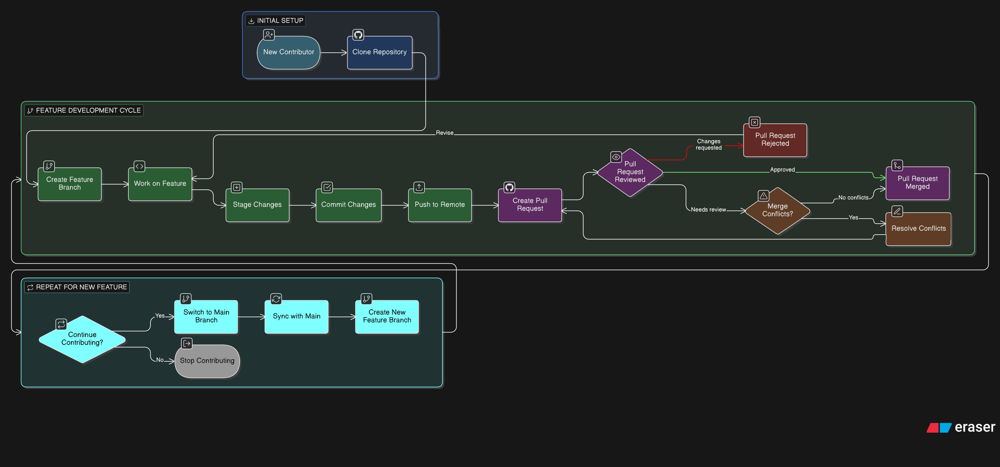

# finance-tracker
Projetu final ba materia Software Engineering

## App Description

## 🔮 Omen — Advanced Personal Finance Tracker
**Omen** mak web-based manejamentu fiancial perosnal ne'ebe kria ho technologia **Django**. Nia funsaun prinsipal atu ajuda user kontorla sira nia osan liu husi monitora income, expensed no vizualiza habitu gastu osan, no mos halo prediksaun ba hahalok financial iha futuro ho machine Learning 

## ✨ Features

**Transaction Management**
User bele log nia income no expense, tau ba kategoria (hahan, transporte, rent, entertainment etc..) no fo sai historia transaksaun fulll iha fatin ida

**Interactive Dashboard**
Vizaun Geral ba saude financial - hatudu total income, osan sai, breakdown kada kategoria no trend fulan nian liu husi grafiku no chart

**Future Spending Prediction**
Liu husi Machine Learning model ne'ebe treinu ho user nia historia transaksaun, Omen bele halo prediksaun osan hira mak use sei hasai iha fulan oin bazeia ba kategoria

**Overspending Alerts & Reminders**
User bele halo budgeting ba kada categoria. No Omen bel automaikamente notifka ba user se quando spending ba kategoria ida nian liu ona nia limite

**User Authentication**
registrasaun seguro, login, logout, no manejamentu password. kada user nia dados privado sei isolado ba nia account deit 

**Admin Panel**
Admin Django nian atu maneja user, categoria transaksaun durante desenvolviment no testing 

## 💻 Tech Stack

| Layer                      |                          Tech                          | Description                         |
| :------------------------------ | :----------------------------------------------------: | ----------------------------------- |
| Front-End                       |            Django Templates + Tailwind CSS             | Chart.js for dashboard visualiation |
| Backend                         |            Django  + Django REST Framework             |                                     |
| Database                        |   SQLite for Developmt <br>PostgreSQL for Production   |                                     |
| Django Allauth                  | For Register, login, and password reset out of the box |                                     |
| Version Control & Collaboration |                      Git + Github                      |                                     |
| Prediction Model                |       Pandas + scikit-learn (Linear Regression)        |                                     |

## 🫂 Team

| Role | Responsibility |
|---|---|
| Requirements Engineer | User stories, use cases, feature definitions |
| Software Developer | Django backend, models, views, prediction model |
| System Designer | Architecture, ER diagram, API design |
| System Tester | Test cases, bug reports, quality assurance |
| System Modeler | UML diagrams, system documentation |****

## Project Setup

Python version: `3.14.2`

Create environment:

```bash
python -m venv venv
source venv/bin/activate
```

Install dependencies:
```bash
pip install -r requirements.txt
```

## Oinsa atu kolabora

Primeiro clone uluk repo ida ne'e ba imi nai local machine ou laptop

```bash
git clone https://github.com/Noro18/omen-finance-tracker.git
```

### 📌 Rules


1. **Labele commit direita ba main branch**

```
git push origin main ❌
git push origin <branch-ne'ebe imi kria> ✅
```


2. Antes atu halo buat ruma make sure tuir workflow iha kraik
3. fo naran ba branch no commit tenki tuir rules iha kraik 
No mos make sure imi nia main branch iha local repo up to date ho remote repo

```bash
git pull origin main 
```

depois mak foin tuir step tuir mai mak branchin 

### Branching


2. kria branch rasik 

wainhria fo naran branch tenki ho formatu 

```bash
prefixo/tugas_nebe_halo
```

ba tugas nian tenki separa ho underscore (_)


#### Prefix Komum

| Prefix          | Signifikadu / Uza | Exemplu |
|-----------------|-----------------|--------|
| `feature/`      | feature foun ka melhoria | `feature/login` |
| `bugfix/`       | Resolve problema ka bug | `bugfix/fix-navbar` |
| `hotfix/`       | Correção urgente ba main branch | `hotfix/security-patch` |
| `docs/`         | Alterasaun iha dokumentasaun | `docs/readme-update` |
| `test/`         | Branch test ka eksperimentu | `test/new-api` |

Atu kria branch ita uza command 

```bash
git checkout -b <branch-nia-naran>
```

3. coding ka halo servisu 
4. Push branch ba iha repo 

depois de ita halo ita nia servisu ita bele push branch ba iha remote repo.

```bash
git push origin <naran-branch>
```

📌 **LABELE MERGE ULUK BA MAIN BRANCXH**

5. Deopis mak owner repo sei revew no merge ba iha main branch

### COMMIT

Wainhria commit make sure commit se wianhira ita halo mudansa logical oan ida  exemplo
- Diak: "Aumenta nav bar"
- La diak: "Update buat hout"

Make sure atu **commit hela** diet maihbe **laos kda liafuan ketik ne'e commit** 

#### Oinsa hakrek commit message

Formato:
```bash
<tipo>(<scope>): <deskrisaun barak>

<Deskrisaun optional saida mak ita halo no tanba sa>
```
exemplo:
```
feature(dashboard): Aumenta Nav Bar

Aumenta nav bar ho menu foun no style foun. TAnba butaun navigasaun ba pagina A seiduak iha
```

##### 1. Tipu Commit (Commit Type)

| Tipu       | Signifikadu / Uza | Exempu |
|-----------|-----------------|--------|
| `feat`    | Função foun / feature | `feat(auth): add login form validation` |
| `fix`     | Halo korrekasaun ba bug | `fix(transactions): correct total amount calculation` |
| `docs`    | Alterasaun iha dokumentasaun | `docs(readme): add installation instructions` |
| `style`   | Formata ka naran codigo, la hanesan bug fix | `style(dashboard): format dashboard cards` |
| `refactor`| Refatoriza codigo, la inclui feature ka fix | `refactor(auth): simplify login validation logic` |
| `test`    | Adisiona ka korrije tests | `test(transactions): add unit tests for recurring payments` |
| `chore`   | Manutensaun, update dependencies | `chore(settings): update default notification values` |

**Regra geral:** primeira palavra (tipu) tenke deskreve buat ne'ebé commit halo.

---

#### 2. Scope (Área / Modulu commit)

- Scope mak parte spesífiku husi app ka projekto ne'ebé commit halo.  
- Klaru hodi hatudu *onde* commit muda kode.  
 
**Exemplu ba Finance Tracker App:**

| Scope         | Buat ne'ebé implica | Exempu commit message |
|---------------|-------------------|---------------------|
| `auth`        | Login, signup, password reset | `feat(auth): add login form validation` |
| `transactions`| Adisiona, edit, remove transasaun | `feat(transactions): allow adding recurring expenses` |
| `dashboard`   | Pagina principal, overview user | `fix(dashboard): correct total balance calculation` |
| `reports`     | Charts, export, relatórios | `feat(reports): add monthly spending chart` |
| `settings`    | Preferensia user, notifications | `chore(settings): update notification defaults` |
| `readme`      | Dokumentasaun | `docs(readme): add installation instructions` |

**Regra geral:**  
- Escolhe scope ne'ebé mais especifica ne'ebé commit muda.  
- Se commit muda ema-liu modulu, split commit ba scope independente ka uza scope gerál `app`.


# Rezumo Workflow (TL:DR)

Contributor foun

```bash
# clone uluk repo

git clone https://github.com/Noro18/omen-finance-tracker.git

# kria branch foun ho tuir regra

git checkout -b <branch-nia-naran>

# Servisu ka aumenta feature foun 

# stage mudansa sira no commit durante servisu 

git add .

git commit -m "Mensagem commit Tuir regra"

# Push ba repo

git push origin <branch-nia-naran>

# e Depois ba github no halo Pull Request atu merge ba main branch
```

Depois hotu tia se karik atu kontinua tan

```bash
# muda ba branch main. 

git checkout main

# update tuir main branch iha github 
git pull origin main

# halo branch foun ba feature foun ne'ebe hakarak aumena

git checkout -b <branch-ba-feature-foun>

# add no commit

# push ba repo 

git push origin <branch-ba-feature-foun>

# ba github no kria pull request
```



#### RULES CODING 

Projetu ida ne'e tuir coding styles nebe tuir best practices professional sira nian. Ba informasaun mais detallu bele le iha [Contribution Guide](CONTRIBUTING.md
)
